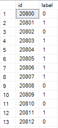
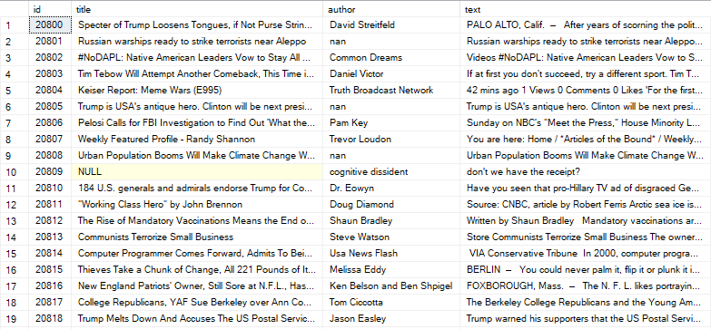
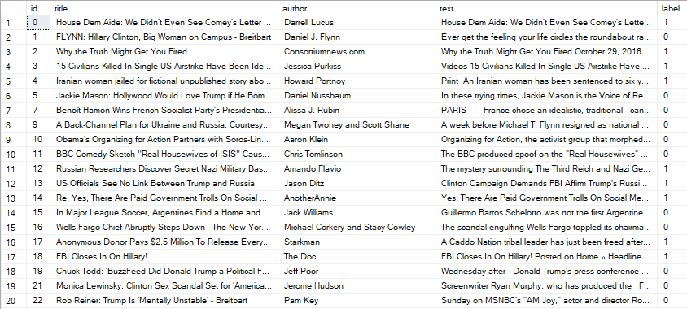
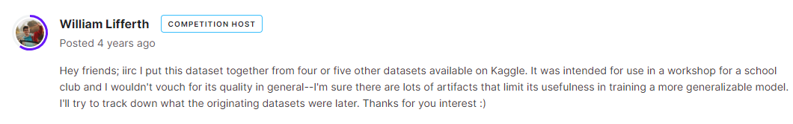
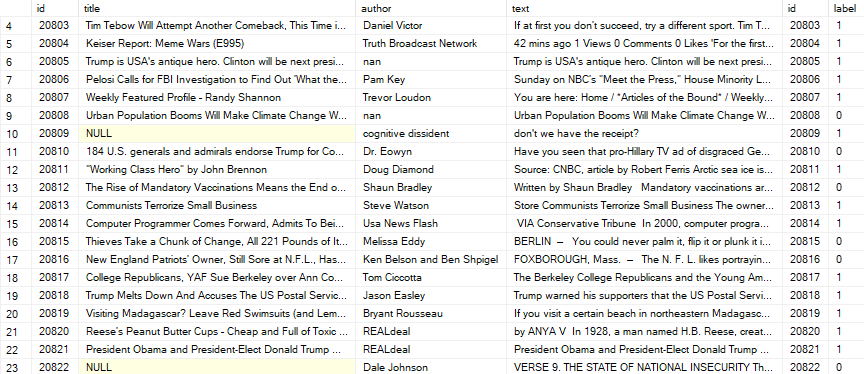
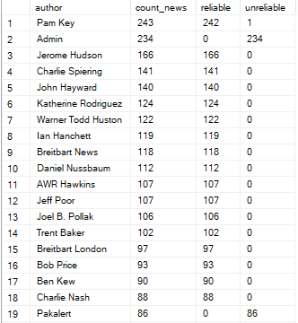
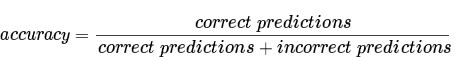
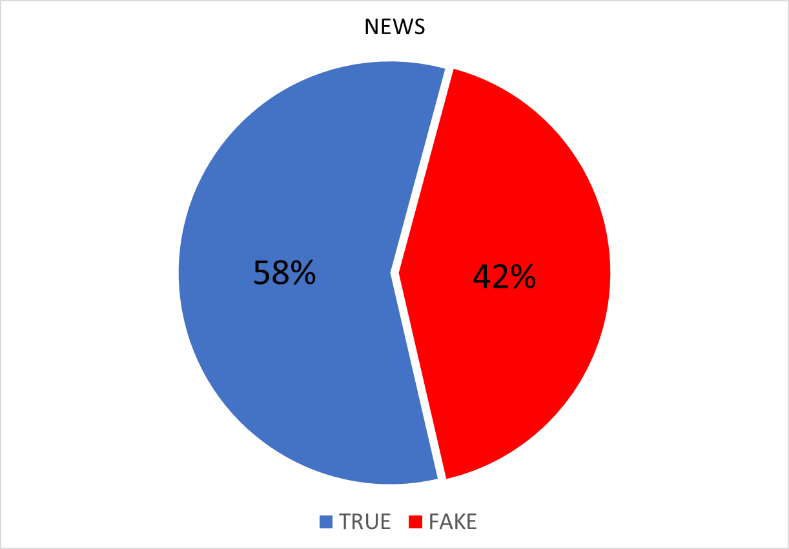
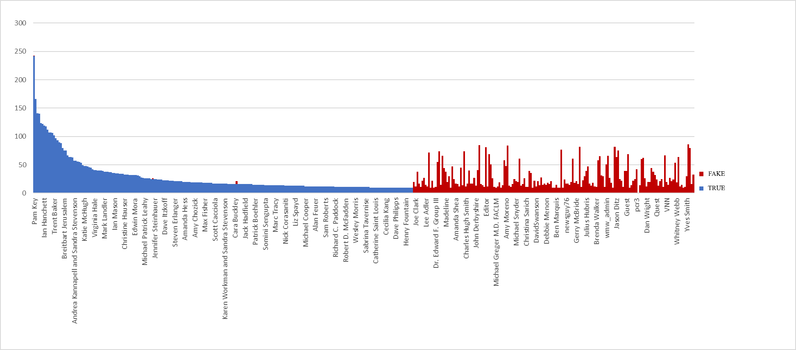

# FAKE NEWS 


## Introduction 

The purpose of this study is to see the percentage of **fake** and **true** news on a sample of news. And also to find out the names of the most **famous liars** and the **most honest** people. In this study you will see all the **steps**:

 1. *Data cleaning*

 2. *Data analysis*

 1. *Data visualization*

 2. *Conclusions*

## SAMPLING  

### Kaggle

The **most important thing in analyzing data is the sample** we are examining. Without a sample we can do nothing (unless of course you are the famous liar). If the sample is incorrect, it will end **very badly** and your conclusions will be wrong and may mislead people. 

**The sample is took is on the world's largest data science community with powerful tools and resources to help you achieve your data science goals -**  [Kaggle](https://www.kaggle.com "Kaggle")! There are many selections of different varieties and flavors on this site. But I chose one of these [FAKE NEWS](https://www.kaggle.com/competitions/fake-news "FAKE NEWS")!

There are three tables contained in this sample: 

- **sumbit.** 
  
  Where the id and label (whether the news is true 1 (unreliable) or 0 (reliable)) are contained.

  
- **test.** 
  
  Where contains the same id, title(News title), author, text(News text).

  
- **train.**
  
  Merging of two previous tables 

  

This dataset contains more than **20,000 strings**. But first we need to evaluate this sample and understand where the data came from. I did a little digging and found the author's response to the comment asking where the data came from. 
  

Okay, let's drop this one, because our research is **not serious**.

## SQL

### Data cleansing 
    
For starters, let's say we don't have a **cheater table** train that contains both id and news truthfulness at once. What should we do then? **JOIN**. The JOIN command in SQL **works wonders** and joins two tables into one! In principle, why don't we use it? 

```sql
SELECT *
FROM dbo.news
JOIN dbo.test ON dbo.news.id = dbo.test.id
```
So we merged the two tables and got one "train" table.


**What's next?** Clean. As we can see the table contains fields containing **NULL** and **"nan"**. For this purpose we use **DELETE FROM**.

```sql
DELETE FROM dbo.train WHERE author ='nan' OR title IS NULL
```

Next, to analyze the data, we need to calculate the number of **true and fake new**s of the author, as well as calculate how many news posted by the author and sort it all by the number of news.

```sql
SELECT author, COUNT(title) as count_news , 
SUM (CASE WHEN label = 0 THEN 1 ELSE 0 END) as reliable, 
SUM (CASE WHEN label = 1 THEN 1 ELSE 0 END) as unreliable
FROM dbo.train
GROUP BY author
ORDER BY count_news DESC 
```



## DATA ANALYSIS

### EXCEL 

To analyze our data we must use **EXCEL**. we open the cleaned dataset with EXCEL. Next, for convenience, we calculate the number of true and fake news and also accuracy. 



## DATA VISUALIZATION

### EXCEL or TABLEAU

To visualize my data I will choose **EXCEL**, but the same can be done in **TABLEAU**. First I made a chart showing the percentage of true and fake news.



 Then a graph showing who made how much true or fake news. 
 
 

 As well as the most interesting **TOP 10 MOST HONEST AND LYING PEOPLE**.

 

 

## CONCLUSIONS

The only thing we can say about the data is that you should not trust all news, because **42%** of the news is wrong, and also the average percentage of **accuracy = 0.573972982**. You can also see the **most lying and honest people**. For this research I used such tools as **SQL and EXCEL** and with the help of them I **cleaned, analyzed and visualized the data**.   
